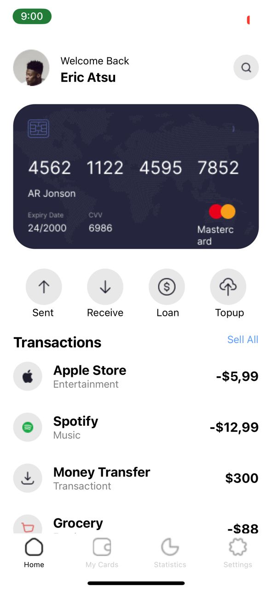
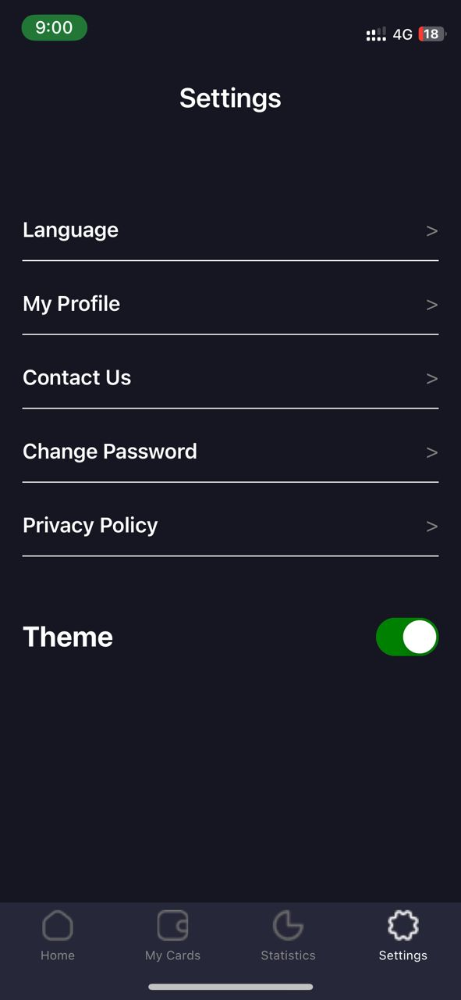
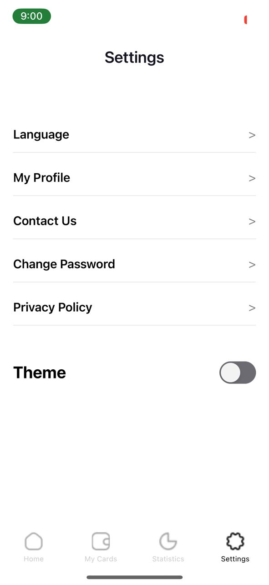
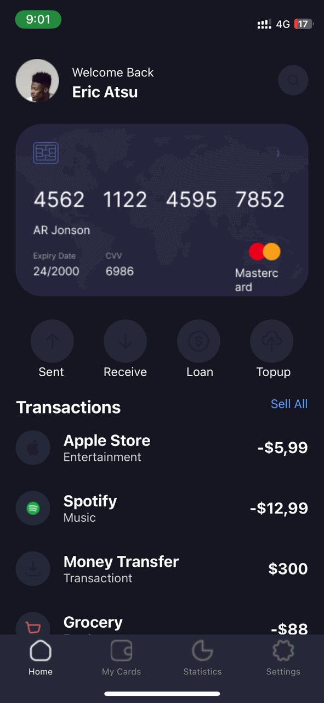

# rn-assignment5-11259806

# Homepage (Dark mode OFF)

# Settings page (Dark Mode ON)

# Settings page (Dark Mode OFF)

# Homepage (Dark Mode ON)

# Description of task

Created the homepage where i rendered Card components for the transaction section
Used BottomTabNavigator to create the navigation on the bottom of the pages.
To render the dark mode, I created a Theme file where i imported the styles and rendered on all other pages.
